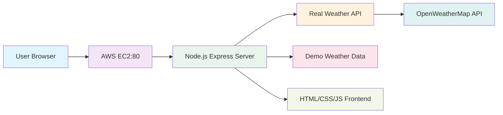

# 🌤️ Real-Time Weather Dashboard (Project 1)
A professional, production-ready weather dashboard built with Node.js, Express, and OpenWeatherMap API, deployed on AWS EC2. Features both real-time weather data and demo mode for testing.


# 🎯 Project Overview
A full-stack web application that provides real-time weather information for cities worldwide. Built with modern web technologies and deployed on AWS infrastructure, this project demonstrates:

Real-time API integration with OpenWeatherMap
AWS EC2 deployment with Ubuntu
Node.js backend with Express.js
Responsive frontend with modern CSS
Both demo and real data modes
Production-ready error handling


# 🌐 Real Data Mode

170,000+ Cities Worldwide - Access weather data for any location
Live API Integration - Real-time data from OpenWeatherMap
Comprehensive Metrics - Temperature, humidity, wind speed, visibility, sunrise/sunset
Geolocation Accuracy - Precise coordinates-based weather fetching
Automatic Refresh - Updates every 5 minutes

# 🎭 Demo Mode

No API Key Required - Instant setup and testing
Realistic Simulation - Professional-looking demo data
Popular Cities - Pre-configured major cities
Fallback System - Automatic switch to demo if API fails


# 🚀 Technical Features

Responsive Design - Mobile-first, works on all devices
Professional UI - Modern gradient backgrounds, animations
Error Handling - Graceful degradation and user-friendly messages
Performance Optimized - Fast loading, minimal dependencies
Production Ready - PM2 process management, auto-restart


# 🏗️ Architecture



# 📦 Prerequisites
Hardware/Cloud Requirements
AWS EC2 Instance (t2.micro free tier eligible)

Ubuntu 22.04 LTS or higher

Minimum 8GB Storage

Public IP Address

Software Requirements
Node.js (v18.x or higher)

npm (Node Package Manager)

Git (for version control)

OpenWeatherMap API Key (free tier)


# AWS Services Used
EC2 - Virtual server

Security Groups - Firewall configuration

Elastic IP (optional) - Static IP address


# 🌤️ Advanced Weather Forecast Application (Project 2)

A feature-rich weather application built with Python that provides current weather conditions, 5-day forecasts, and interactive charts. Designed for AWS EC2 deployment with PuTTY support.

## ✨ Features

- ✅ **Current Weather** with detailed metrics
- ✅ **5-Day Forecast** with daily summaries
- ✅ **Interactive ASCII Temperature Charts**
- ✅ **File Export** for weather reports
- ✅ **Error Handling** & User-friendly interface
- ✅ **AWS EC2 Optimized** for Amazon Linux
- ✅ **Environment Variables** for secure configuration
- ✅ **Multi-city Support** with history tracking

## 🚀 Quick Start

### Prerequisites
- Python 3.8+
- OpenWeatherMap API Key (Free)
- AWS EC2 Instance (Optional)

### Installation

```bash
# Clone the repository
git clone https://github.com/yourusername/advanced-weather-app.git
cd advanced-weather-app

# Install dependencies
pip install -r requirements.txt

# Configure API key
cp .env.example .env
# Edit .env with your API key
```

# Architecture Diagram for Advanced Weather App on AWS EC2

```
┌─────────────────────────────────────────────────────────────────────────────┐
│                                                                             │
│                         USER INTERFACE LAYER                                │
│                                                                             │
├─────────────────────────────────────────────────────────────────────────────┤
│                                                                             │
│  ┌─────────────────────────────────────────────────────────────────────┐   │
│  │                        CLI Application                              │   │
│  │  ┌─────────────────────────────────────────────────────────────┐   │   │
│  │  │    Interactive Menu System                                  │   │   │
│  │  │  • Get Current Weather                                      │   │   │
│  │  │  • Get 5-Day Forecast                                       │   │   │
│  │  │  • Temperature Charts                                       │   │   │
│  │  │  • File Export                                              │   │   │
│  │  │  • Search History                                           │   │   │
│  │  └─────────────────────────────────────────────────────────────┘   │   │
│  └─────────────────────────────────────────────────────────────────────┘   │
│                                                                             │
├─────────────────────────────────────────────────────────────────────────────┤
│                                                                             │
│                        APPLICATION LAYER                                    │
│                                                                             │
├─────────────────────────────────────────────────────────────────────────────┤
│  ┌──────────────┐  ┌──────────────┐  ┌──────────────┐  ┌──────────────┐   │
│  │  WeatherApp  │  │    Config    │  │    Logger    │  │    Cache     │   │
│  │   Class      │◀─▶│  Manager    │◀─▶│   Manager   │◀─▶│   Manager    │   │
│  │              │  │              │  │              │  │   (Optional) │   │
│  └──────────────┘  └──────────────┘  └──────────────┘  └──────────────┘   │
│         │                   │                   │                   │      │
│         ▼                   ▼                   ▼                   ▼      │
│  ┌──────────────┐  ┌──────────────┐  ┌──────────────┐  ┌──────────────┐   │
│  │  API Client  │  │  Data        │  │  Error       │  │  File        │   │
│  │  (Requests)  │  │  Processor   │  │  Handler     │  │  Manager     │   │
│  │              │  │              │  │              │  │              │   │
│  └──────────────┘  └──────────────┘  └──────────────┘  └──────────────┘   │
│         │                   │                   │                   │      │
│         ▼                   ▼                   ▼                   ▼      │
├─────────────────────────────────────────────────────────────────────────────┤
│                                                                             │
│                         DATA LAYER                                          │
│                                                                             │
├─────────────────────────────────────────────────────────────────────────────┤
│  ┌─────────────────────────────────────────────────────────────────────┐   │
│  │                     External APIs                                    │   │
│  │  ┌─────────────────────────────────────────────────────────────┐   │   │
│  │  │              OpenWeatherMap API                             │   │   │
│  │  │  • Current Weather Endpoint                                │   │   │
│  │  │  • 5-Day Forecast Endpoint                                 │   │   │
│  │  │  • Free/Paid Tiers                                         │   │   │
│  │  └─────────────────────────────────────────────────────────────┘   │   │
│  └─────────────────────────────────────────────────────────────────────┘   │
│         │                                                                   │
│         ▼                                                                   │
│  ┌─────────────────────────────────────────────────────────────────────┐   │
│  │                     Storage Systems                                  │   │
│  │  ┌──────────────┐  ┌──────────────┐  ┌──────────────┐             │   │
│  │  │  Local Files │  │   SQLite DB  │  │  AWS S3      │             │   │
│  │  │ • Weather    │  │ • Historical │  │ • Reports    │             │   │
│  │  │   Reports    │  │   Data       │  │   Archive    │             │   │
│  │  │ • Logs       │  │ • User       │  │ • Backups    │             │   │
│  │  │ • Config     │  │   Preferences│  │              │             │   │
│  │  └──────────────┘  └──────────────┘  └──────────────┘             │   │
│  └─────────────────────────────────────────────────────────────────────┘   │
│                                                                             │
├─────────────────────────────────────────────────────────────────────────────┤
│                                                                             │
│                     INFRASTRUCTURE LAYER                                    │
│                                                                             │
├─────────────────────────────────────────────────────────────────────────────┤
│  ┌─────────────────────────────────────────────────────────────────────┐   │
│  │                        AWS EC2 Instance                              │   │
│  │  ┌─────────────────────────────────────────────────────────────┐   │   │
│  │  │  Amazon Linux 2023                                         │   │   │
│  │  │  • Python 3.9+                                             │   │   │
│  │  │  • Systemd Service                                         │   │   │
│  │  │  • Cron Jobs                                               │   │   │
│  │  │  • Firewall (Security Group)                               │   │   │
│  │  └─────────────────────────────────────────────────────────────┘   │   │
│  │                                                                     │   │
│  │  ┌─────────────────────────────────────────────────────────────┐   │   │
│  │  │  Networking & Security                                      │   │   │
│  │  │  • SSH Access (Port 22)                                     │   │   │
│  │  │  • Security Group Rules                                     │   │   │
│  │  │  • IAM Roles & Policies                                     │   │   │
│  │  │  • VPC Configuration                                        │   │   │
│  │  └─────────────────────────────────────────────────────────────┘   │   │
│  └─────────────────────────────────────────────────────────────────────┘   │
│                                                                             │
└─────────────────────────────────────────────────────────────────────────────┘
```

# Component Interaction Flow
```
┌─────────┐     ┌──────────────┐     ┌──────────────┐     ┌─────────────────┐
│         │     │              │     │              │     │                 │
│   User  │────▶│  CLI Input   │────▶│   Weather    │────▶│  OpenWeatherMap │
│         │     │   Handler    │     │    API       │     │       API       │
│         │     │              │     │   Client     │     │                 │
└─────────┘     └──────────────┘     └──────────────┘     └─────────────────┘
                                                  │                    │
                                                  │                    │
                                                  ▼                    ▼
                                         ┌──────────────┐     ┌─────────────────┐
                                         │              │     │                 │
                                         │  Response    │◀────│  JSON Response  │
                                         │   Parser     │     │                 │
                                         └──────────────┘     └─────────────────┘
                                                  │
                                                  ▼
                                         ┌──────────────┐
                                         │              │
                                         │  Data        │
                                         │  Formatter   │
                                         └──────────────┘
                                                  │
                                                  ▼
                     ┌────────────────────────────────────────────┐
                     │                                            │
        ┌────────────▼────────────┐                  ┌────────────▼────────────┐
        │                         │                  │                         │
        │   Display to User       │                  │   Save to Storage       │
        │   • Formatted Output    │                  │   • File System         │
        │   • ASCII Charts        │                  │   • Database            │
        │   • Colorful UI         │                  │   • Cloud Storage       │
        │                         │                  │                         │
        └─────────────────────────┘                  └─────────────────────────┘
```
